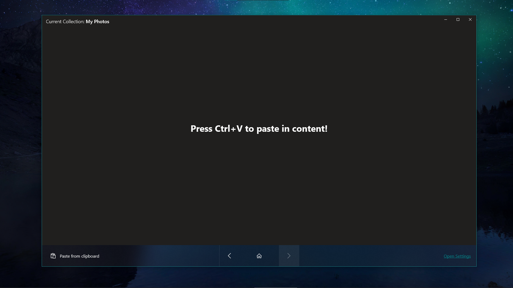

# Clipboard Canvas
Clipboard Canvas gives users an enhanced clipboard experience. Clipboard Canvas enables you to paste content worry free increasing your productivity.

# Get Clipboard Canvas
- [Microsoft Store](https://www.microsoft.com/pl-pl/p/clipboard-canvas-preview/9nn2nzg8rltb#activetab=pivot:overviewtab)
- [Releases](https://github.com/d2dyno1/ClipboardCanvas/releases)

# Features

- Automatically save content to your hard drive
- Seamlessly preview your files in available previews:
  - Image preview
  - GIF preview
  - Media preview
  - PDF preview
  - Markdown preview
  - Html preview
- Paste as Reference - allows you to paste your files as reference to the original file saving space on your drive.
