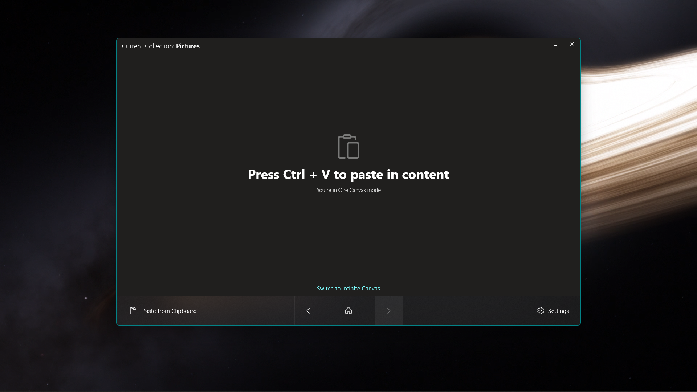

# Clipboard Canvas
Clipboard Canvas gives users an enhanced clipboard experience. Clipboard Canvas enables you to paste content worry free increasing your productivity.

# Get Clipboard Canvas
- [Microsoft Store](https://apps.microsoft.com/detail/9nn2nzg8rltb)
- [Releases](https://github.com/d2dyno1/ClipboardCanvas/releases)

> [!TIP]
> The current 2.4.1.0 version of Clipboard Canvas, found on the Microsoft Store lacks the latest features and bug fixes. A new, built from the ground up, V3 version is currently in the works and is expected to be released by the end of Q3 2025.

# Features

- Automatically save content to your hard drive
- Seamlessly preview your files in available previews:
  - Image preview
  - GIF preview
  - Media preview
  - Markdown preview
  - Text preview
  - Html preview
- Paste as Reference - allows you to paste your files as reference to the original file saving space on your drive.

# Contributing

See [CONTRIBUTING](CONTRIBUTING.md)
